# github-actions-lab

## 1. Workflow CI para el proyecto de frontend
### Archivo de workflow
1. Evento disparador del workflow al hacer PR y requisito de modificaciones en carpeta hangman-front.

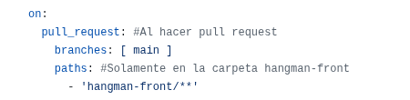

2. Job Build para compilar el proyecto en el entorno seleccionado ubuntu con node versión 20.

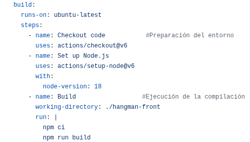

3. Ejecución de tests comprobar el correcto funcionamiento.

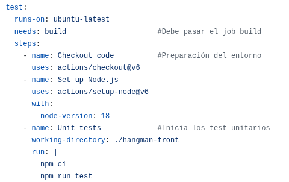

### Modificación
Se ha modificado el archivo hangman-front/src/index.html. Se cambia el título de la página web.

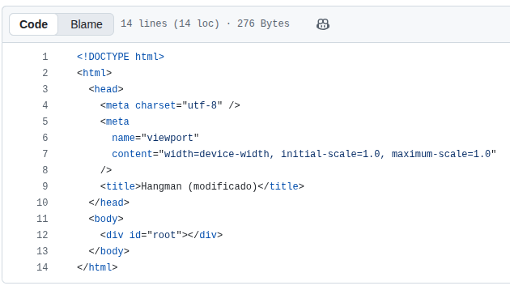

## Ejecución de PR
Al hacer push del archivo index.html y ejecutar el pull request, el build finaliza correctamente y falla en los test.

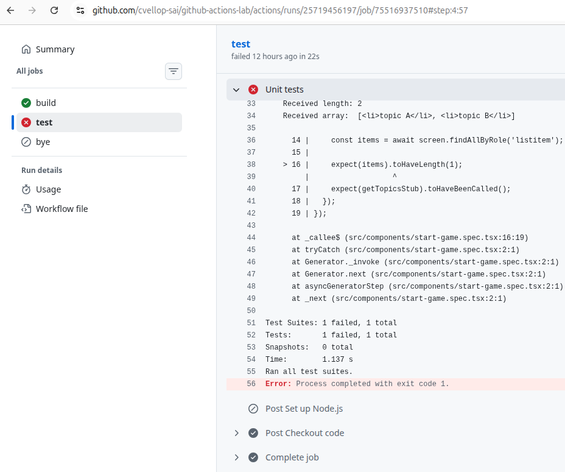

Habría que modificar el código para que pase los tests, en este caso modificando el 1 por 2 en el argumento de .toHaveLength.

Una vez modificado ya pasa los tests.

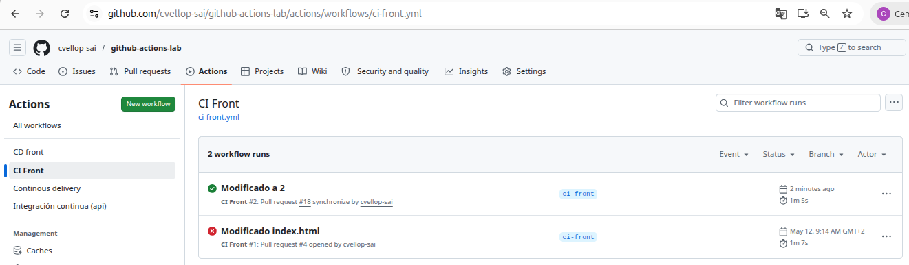

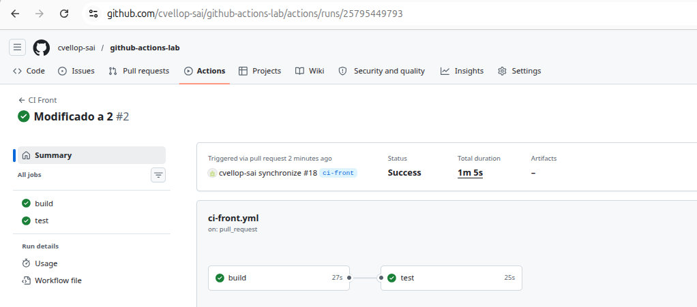

## 2. Workflow CD para el proyecto de frontend
### Archivo de workflow

1. Evento disparador del workflow: manual (workflow_dispatch).

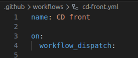

2. Tareas para el envío: checkout del proyecto, docker login y build and push.

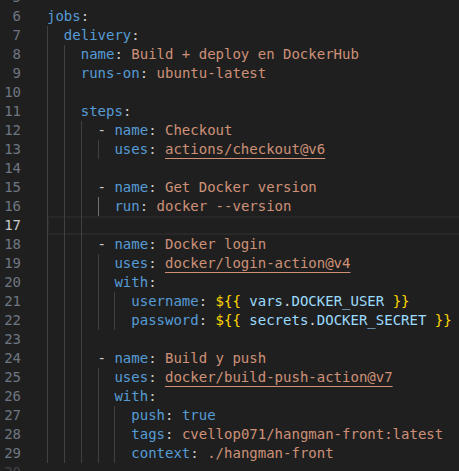

### Configuración de DOCKER_USER y DOCKER_SECRET

1. Variable DOCKER_USER

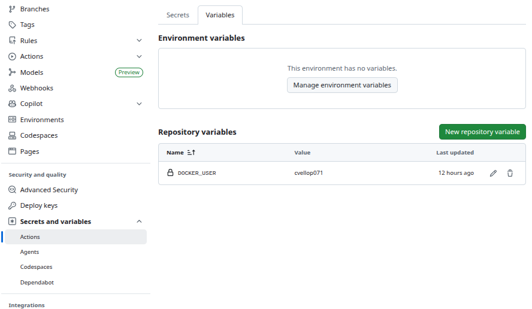

2. Secret DOCKER_SECRET

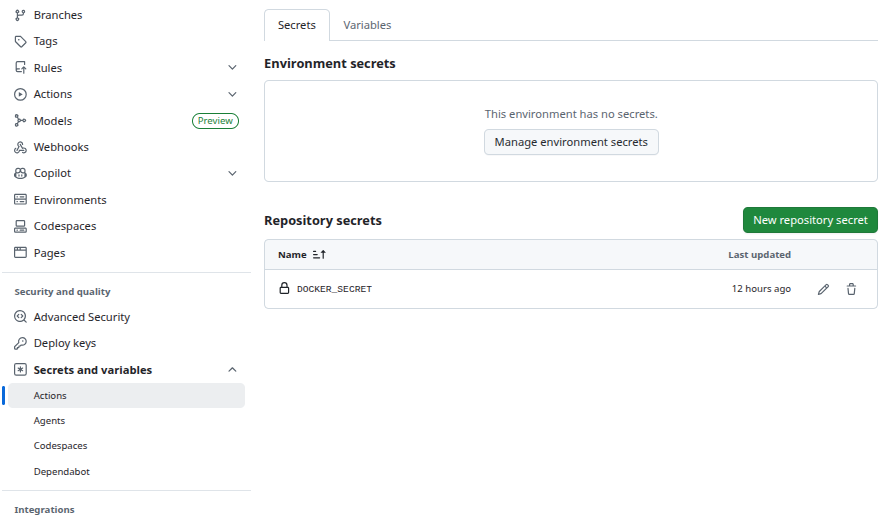

### Ejecución

1. Workflow

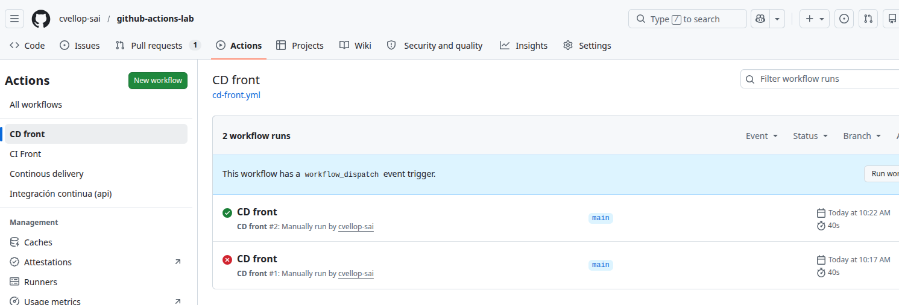

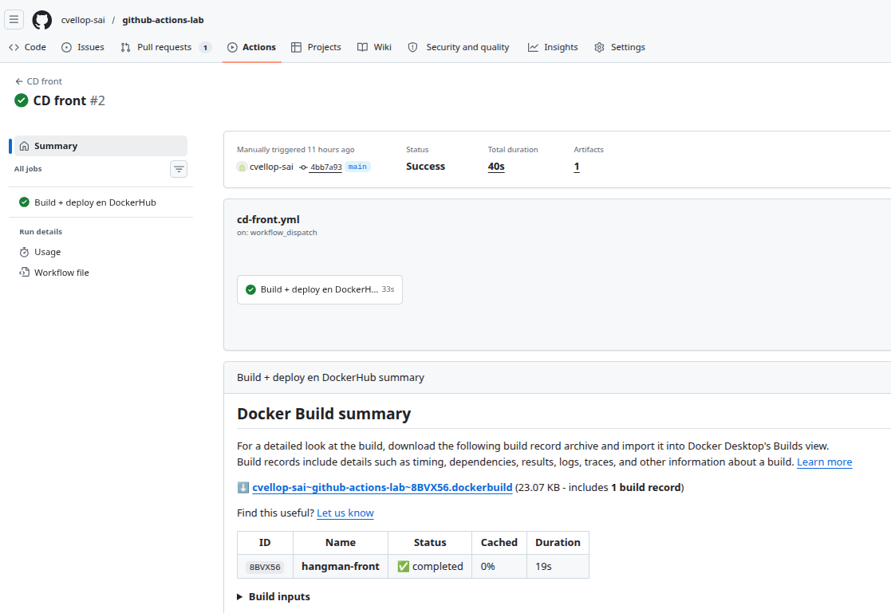

2. Publicación en DockerHub

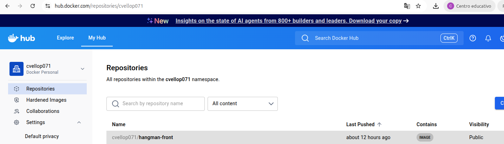

   
